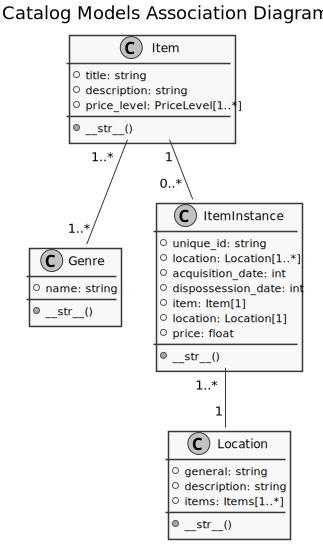

Developer Notes
===============

Mozilla Tutorial Part 2
-----------------------

Overview
^^^^^^^^

#. :ref:`2conda-env`
#. :ref:`2generate-project`
#. :ref:`2create-app`
#. :ref:`2docs`
#. :ref:`2register`
#. :ref:`2database`

.. _2conda-env:

Create a ``conda`` Environment
^^^^^^^^^^^^^^^^^^^^^^^^^^^^^^

Create an environment for the project.

Tell ``conda`` to specifically use python version 3.8, because 3.9 is not yet 
supported by PostgreSQL, the database that will be used.

.. code:: console

    (base) [20:49:43 kendall@ArchLinux django]$ conda create -y --name kjn python=3.8
    Collecting package metadata (current_repodata.json): done
    Solving environment: done

    ==> WARNING: A newer version of conda exists. <==
    current version: 4.8.5
    latest version: 4.9.2

    Please update conda by running

        $ conda update -n base -c defaults conda

    ## Package Plan ##

    environment location: /home/kendall/miniconda3/envs/kjn

    added / updated specs:
        - python=3.8

    The following packages will be downloaded:

        package                    |            build
        ---------------------------|-----------------
        certifi-2020.11.8          |   py38h06a4308_0         147 KB
        pip-20.2.4                 |   py38h06a4308_0         1.8 MB
        setuptools-50.3.1          |   py38h06a4308_1         714 KB
        ------------------------------------------------------------
                                            Total:         2.6 MB

    The following NEW packages will be INSTALLED:

    _libgcc_mutex      pkgs/main/linux-64::_libgcc_mutex-0.1-main
    ca-certificates    pkgs/main/linux-64::ca-certificates-2020.10.14-0
    certifi            pkgs/main/linux-64::certifi-2020.11.8-py38h06a4308_0
    ld_impl_linux-64   pkgs/main/linux-64::ld_impl_linux-64-2.33.1-h53a641e_7
    libedit            pkgs/main/linux-64::libedit-3.1.20191231-h14c3975_1
    libffi             pkgs/main/linux-64::libffi-3.3-he6710b0_2
    libgcc-ng          pkgs/main/linux-64::libgcc-ng-9.1.0-hdf63c60_0
    libstdcxx-ng       pkgs/main/linux-64::libstdcxx-ng-9.1.0-hdf63c60_0
    ncurses            pkgs/main/linux-64::ncurses-6.2-he6710b0_1
    openssl            pkgs/main/linux-64::openssl-1.1.1h-h7b6447c_0
    pip                pkgs/main/linux-64::pip-20.2.4-py38h06a4308_0
    python             pkgs/main/linux-64::python-3.8.5-h7579374_1
    readline           pkgs/main/linux-64::readline-8.0-h7b6447c_0
    setuptools         pkgs/main/linux-64::setuptools-50.3.1-py38h06a4308_1
    sqlite             pkgs/main/linux-64::sqlite-3.33.0-h62c20be_0
    tk                 pkgs/main/linux-64::tk-8.6.10-hbc83047_0
    wheel              pkgs/main/noarch::wheel-0.35.1-pyhd3eb1b0_0
    xz                 pkgs/main/linux-64::xz-5.2.5-h7b6447c_0
    zlib               pkgs/main/linux-64::zlib-1.2.11-h7b6447c_3

    Downloading and Extracting Packages
    setuptools-50.3.1    | 714 KB    | ######################################################################################## | 100% 

    certifi-2020.11.8    | 147 KB    | ######################################################################################## | 100% 
    pip-20.2.4           | 1.8 MB    | ######################################################################################## | 100% 
    Preparing transaction: done
    Verifying transaction: done
    Executing transaction: done
    #
    # To activate this environment, use
    #
    #     $ conda activate kjn
    #
    # To deactivate an active environment, use
    #
    #     $ conda deactivate

.. _2generate-project:

Use ``django-admin`` to Generate a Project
^^^^^^^^^^^^^^^^^^^^^^^^^^^^^^^^^^^^^^^^^^

Activate the newly created environment and install django.

.. code:: console

    (base) [20:53:41 kendall@ArchLinux django]$ conda activate kjn
    (kjn) [20:54:21 kendall@ArchLinux django]$ conda install -y django
    Collecting package metadata (current_repodata.json): done
    Solving environment: done

    ## Package Plan ##

    environment location: /home/kendall/miniconda3/envs/kjn

    added / updated specs:
        - django

    The following packages will be downloaded:

        package                    |            build
        ---------------------------|-----------------
        asgiref-3.3.1              |     pyhd3eb1b0_0          22 KB
        sqlparse-0.4.1             |             py_0          35 KB
        ------------------------------------------------------------
                                            Total:          57 KB

    The following NEW packages will be INSTALLED:

    asgiref            pkgs/main/noarch::asgiref-3.3.1-pyhd3eb1b0_0
    django             pkgs/main/noarch::django-3.1.3-pyhd3eb1b0_0
    krb5               pkgs/main/linux-64::krb5-1.17.1-h173b8e3_0
    libpq              pkgs/main/linux-64::libpq-12.2-h20c2e04_0
    psycopg2           pkgs/main/linux-64::psycopg2-2.8.5-py38h1ba5d50_0
    pytz               pkgs/main/noarch::pytz-2020.1-py_0
    sqlparse           pkgs/main/noarch::sqlparse-0.4.1-py_0

    Downloading and Extracting Packages
    sqlparse-0.4.1       | 35 KB     | ######################################################################################## | 100% 
    asgiref-3.3.1        | 22 KB     | ######################################################################################## | 100% 
    Preparing transaction: done
    Verifying transaction: done
    Executing transaction: done

Once django is installed, ``django-admin`` can be invoked to create a new
project.

.. code:: console

    (kjn) [20:54:32 kendall@ArchLinux django]$ django-admin startproject kjn
    (kjn) [20:55:07 kendall@ArchLinux django]$ cd kjn
    (kjn) [20:55:15 kendall@ArchLinux kjn]$ tree
    .
    ├── kjn
    │   ├── asgi.py
    │   ├── __init__.py
    │   ├── settings.py
    │   ├── urls.py
    │   └── wsgi.py
    └── manage.py

    1 directory, 6 files

.. _2create-app:

Use **manage.py** to Create an App
^^^^^^^^^^^^^^^^^^^^^^^^^^^^^^^^^^

Since the base of the project is generated, an app can be created to be used by
the project.

.. code:: console

    (kjn) [20:58:37 kendall@ArchLinux kjn]$ ./manage.py startapp catalog
    (kjn) [21:00:06 kendall@ArchLinux kjn]$ tree
    .
    ├── catalog
    │   ├── admin.py
    │   ├── apps.py
    │   ├── __init__.py
    │   ├── migrations
    │   │   └── __init__.py
    │   ├── models.py
    │   ├── tests.py
    │   └── views.py
    ├── kjn
    │   ├── asgi.py
    │   ├── __init__.py
    │   ├── __pycache__
    │   │   ├── __init__.cpython-38.pyc
    │   │   └── settings.cpython-38.pyc
    │   ├── settings.py
    │   ├── urls.py
    │   └── wsgi.py
    └── manage.py

    4 directories, 15 files

.. _2docs:

Create Documentation Folder
^^^^^^^^^^^^^^^^^^^^^^^^^^^

.. code:: console

    (kjn) [21:00:11 kendall@ArchLinux kjn]$ mkdir docs
    (kjn) [21:00:56 kendall@ArchLinux kjn]$ cd docs/

Install Sphinx and run ``sphinx-quickstart``.

.. code:: console

    (kjn) [21:01:34 kendall@ArchLinux docs]$ conda install -y sphinx
    Collecting package metadata (current_repodata.json): done
    Solving environment: done

    ## Package Plan ##

    environment location: /home/kendall/miniconda3/envs/kjn

    added / updated specs:
        - sphinx

    The following packages will be downloaded:

        package                    |            build
        ---------------------------|-----------------
        alabaster-0.7.12           |             py_0          16 KB
        babel-2.8.1                |     pyhd3eb1b0_0         5.3 MB
        docutils-0.16              |           py38_1         672 KB
        imagesize-1.2.0            |             py_0          10 KB
        jinja2-2.11.2              |             py_0         103 KB
        markupsafe-1.1.1           |   py38h7b6447c_0          33 KB
        packaging-20.4             |             py_0          36 KB
        pygments-2.7.2             |     pyhd3eb1b0_0         674 KB
        pyparsing-2.4.7            |             py_0          65 KB
        snowballstemmer-2.0.0      |             py_0          62 KB
        sphinx-3.2.1               |             py_0         1.1 MB
        sphinxcontrib-applehelp-1.0.2|             py_0          27 KB
        sphinxcontrib-devhelp-1.0.2|             py_0          22 KB
        sphinxcontrib-htmlhelp-1.0.3|             py_0          27 KB
        sphinxcontrib-jsmath-1.0.1 |             py_0           9 KB
        sphinxcontrib-qthelp-1.0.3 |             py_0          25 KB
        sphinxcontrib-serializinghtml-1.1.4|             py_0          24 KB
        ------------------------------------------------------------
                                            Total:         8.2 MB

    The following NEW packages will be INSTALLED:

    alabaster          pkgs/main/noarch::alabaster-0.7.12-py_0
    babel              pkgs/main/noarch::babel-2.8.1-pyhd3eb1b0_0
    brotlipy           pkgs/main/linux-64::brotlipy-0.7.0-py38h27cfd23_1003
    cffi               pkgs/main/linux-64::cffi-1.14.3-py38h261ae71_2
    chardet            pkgs/main/linux-64::chardet-3.0.4-py38h06a4308_1003
    cryptography       pkgs/main/linux-64::cryptography-3.2.1-py38h3c74f83_1
    docutils           pkgs/main/linux-64::docutils-0.16-py38_1
    idna               pkgs/main/noarch::idna-2.10-py_0
    imagesize          pkgs/main/noarch::imagesize-1.2.0-py_0
    jinja2             pkgs/main/noarch::jinja2-2.11.2-py_0
    markupsafe         pkgs/main/linux-64::markupsafe-1.1.1-py38h7b6447c_0
    packaging          pkgs/main/noarch::packaging-20.4-py_0
    pycparser          pkgs/main/noarch::pycparser-2.20-py_2
    pygments           pkgs/main/noarch::pygments-2.7.2-pyhd3eb1b0_0
    pyopenssl          pkgs/main/noarch::pyopenssl-19.1.0-pyhd3eb1b0_1
    pyparsing          pkgs/main/noarch::pyparsing-2.4.7-py_0
    pysocks            pkgs/main/linux-64::pysocks-1.7.1-py38h06a4308_0
    requests           pkgs/main/noarch::requests-2.24.0-py_0
    six                pkgs/main/linux-64::six-1.15.0-py38h06a4308_0
    snowballstemmer    pkgs/main/noarch::snowballstemmer-2.0.0-py_0
    sphinx             pkgs/main/noarch::sphinx-3.2.1-py_0
    sphinxcontrib-app~ pkgs/main/noarch::sphinxcontrib-applehelp-1.0.2-py_0
    sphinxcontrib-dev~ pkgs/main/noarch::sphinxcontrib-devhelp-1.0.2-py_0
    sphinxcontrib-htm~ pkgs/main/noarch::sphinxcontrib-htmlhelp-1.0.3-py_0
    sphinxcontrib-jsm~ pkgs/main/noarch::sphinxcontrib-jsmath-1.0.1-py_0
    sphinxcontrib-qth~ pkgs/main/noarch::sphinxcontrib-qthelp-1.0.3-py_0
    sphinxcontrib-ser~ pkgs/main/noarch::sphinxcontrib-serializinghtml-1.1.4-py_0
    urllib3            pkgs/main/noarch::urllib3-1.25.11-py_0

    Downloading and Extracting Packages
    sphinxcontrib-devhel | 22 KB     | ######################################################################################## | 100% 
    sphinxcontrib-jsmath | 9 KB      | ######################################################################################## | 100% 
    pygments-2.7.2       | 674 KB    | ######################################################################################## | 100% 
    jinja2-2.11.2        | 103 KB    | ######################################################################################## | 100% 
    sphinxcontrib-htmlhe | 27 KB     | ######################################################################################## | 100% 
    imagesize-1.2.0      | 10 KB     | ######################################################################################## | 100% 
    markupsafe-1.1.1     | 33 KB     | ######################################################################################## | 100% 
    sphinxcontrib-serial | 24 KB     | ######################################################################################## | 100% 
    pyparsing-2.4.7      | 65 KB     | ######################################################################################## | 100% 
    alabaster-0.7.12     | 16 KB     | ######################################################################################## | 100% 
    snowballstemmer-2.0. | 62 KB     | ######################################################################################## | 100% 
    sphinxcontrib-appleh | 27 KB     | ######################################################################################## | 100% 
    docutils-0.16        | 672 KB    | ######################################################################################## | 100% 
    packaging-20.4       | 36 KB     | ######################################################################################## | 100% 
    babel-2.8.1          | 5.3 MB    | ######################################################################################## | 100% 
    sphinx-3.2.1         | 1.1 MB    | ######################################################################################## | 100% 
    sphinxcontrib-qthelp | 25 KB     | ######################################################################################## | 100% 
    Preparing transaction: done
    Verifying transaction: done
    Executing transaction: done

Run ``sphinx-quickstart`` to generate the documentation folder skeleton.

.. code:: console

    (kjn) [21:01:45 kendall@ArchLinux docs]$ sphinx-quickstart
    Welcome to the Sphinx 3.2.1 quickstart utility.

    Please enter values for the following settings (just press Enter to
    accept a default value, if one is given in brackets).

    Selected root path: .

    You have two options for placing the build directory for Sphinx output.
    Either, you use a directory "_build" within the root path, or you separate
    "source" and "build" directories within the root path.
    > Separate source and build directories (y/n) [n]: y

    The project name will occur in several places in the built documentation.
    > Project name: Clean Your Room
    > Author name(s): Kendall
    > Project release []: 0.0

    If the documents are to be written in a language other than English,
    you can select a language here by its language code. Sphinx will then
    translate text that it generates into that language.

    For a list of supported codes, see
    https://www.sphinx-doc.org/en/master/usage/configuration.html#confval-language.
    > Project language [en]: 

    Creating file /home/kendall/Projects/pythonprojects/django/kjn/docs/source/conf.py.
    Creating file /home/kendall/Projects/pythonprojects/django/kjn/docs/source/index.rst.
    Creating file /home/kendall/Projects/pythonprojects/django/kjn/docs/Makefile.
    Creating file /home/kendall/Projects/pythonprojects/django/kjn/docs/make.bat.

    Finished: An initial directory structure has been created.

    You should now populate your master file /home/kendall/Projects/pythonprojects/django/kjn/docs/source/index.rst and create other documentation
    source files. Use the Makefile to build the docs, like so:
    make builder
    where "builder" is one of the supported builders, e.g. html, latex or linkcheck.

Start these developer notes.

.. code:: console

    (kjn) [21:06:29 kendall@ArchLinux docs]$ vim source/developer_notes.rst

.. _2register:

Register the Application
^^^^^^^^^^^^^^^^^^^^^^^^

Now that the application has bee created, we have to register it with the project
so that it will be included when any tools are run (like adding models to the database,
for example). Applications are registered by adding them to the ``INSTALLED_APPS``
list in the project settings.

Open the project settings file, **kjn/kjn/settings.py**, and find the definition
for the ``INSTALLED_APPS`` list. Then add a new line, as indicated:

.. code-block:: python
   :emphasize-lines: 2

    INSTALLED_APPS = [
        'catalog'
        'django.contrib.admin',
        'django.contrib.auth',
        'django.contrib.contenttypes',
        'django.contrib.sessions',
        'django.contrib.messages',
        'django.contrib.staticfiles',
    ]

The new line specifies the application configuration object (``CatalogConfig``)
that was generated in **kjn/catalog/apps.py** when the application was created.

.. _2database:

Specifying the Database
^^^^^^^^^^^^^^^^^^^^^^^

Here begins to deviate from the tutorial. Instead of sticking to the simple default
of SQLite, PostgreSQL will be used from the beginning to `avoid database-switching 
headaches down the road <https://docs.djangoproject.com/en/3.1/intro/tutorial02/#database-setup>`_.

Installing PostgreSQL
"""""""""""""""""""""

Let's follow the instructions in the `Arch Wiki <https://wiki.archlinux.org/index.php/PostgreSQL>`_.

Install the package.

.. code:: console

    (kjn) [21:09:55 kendall@ArchLinux kjn]$ sudo pacman -S postgresql
    [sudo] password for kendall: 
    warning: postgresql-12.4-1 is up to date -- reinstalling
    resolving dependencies...
    looking for conflicting packages...

    Packages (1) postgresql-12.4-1

    Total Installed Size:  52.09 MiB
    Net Upgrade Size:       0.00 MiB

    :: Proceed with installation? [Y/n] 
    (1/1) checking keys in keyring                                                 [#############################################] 100%
    (1/1) checking package integrity                                               [#############################################] 100%
    (1/1) loading package files                                                    [#############################################] 100%
    (1/1) checking for file conflicts                                              [#############################################] 100%
    (1/1) checking available disk space                                            [#############################################] 100%
    :: Processing package changes...
    (1/1) reinstalling postgresql                                                  [#############################################] 100%
    :: Running post-transaction hooks...
    (1/4) Creating system user accounts...
    (2/4) Reloading system manager configuration...
    (3/4) Creating temporary files...
    (4/4) Arming ConditionNeedsUpdate...

Installing the package also created a system user called *postgres* through which
the database needs to be initialized.

.. code:: console

    (kjn) [21:10:20 kendall@ArchLinux kjn]$ sudo -iu postgres
    [sudo] password for kendall: 
    [postgres@ArchLinux ~]$ initdb -D /var/lib/postgres/data
    The files belonging to this database system will be owned by user "postgres".
    This user must also own the server process.

    The database cluster will be initialized with locale "en_US.UTF-8".
    The default database encoding has accordingly been set to "UTF8".
    The default text search configuration will be set to "english".

    Data page checksums are disabled.

    fixing permissions on existing directory /var/lib/postgres/data ... ok
    creating subdirectories ... ok
    selecting dynamic shared memory implementation ... posix
    selecting default max_connections ... 100
    selecting default shared_buffers ... 128MB
    selecting default time zone ... America/Los_Angeles
    creating configuration files ... ok
    running bootstrap script ... ok
    performing post-bootstrap initialization ... ok
    syncing data to disk ... ok

    initdb: warning: enabling "trust" authentication for local connections
    You can change this by editing pg_hba.conf or using the option -A, or
    --auth-local and --auth-host, the next time you run initdb.

    Success. You can now start the database server using:

        pg_ctl -D /var/lib/postgres/data -l logfile start
    [postgres@ArchLinux ~]$ exit

The locale and encoding were correctly inferred from the current environment, so
no need to change those.

And since the success message is received, time to start the postgresql service.

.. code:: console

    (kjn) [21:25:49 kendall@ArchLinux kjn]$ sudo systemctl start postgresql

By the wiki, create a user the same name as Arch Linux login.

.. code:: console

    (kjn) [21:25:55 kendall@ArchLinux kjn]$ sudo -iu postgres
    [sudo] password for kendall: 
    [postgres@ArchLinux ~]$ createuser --interactive
    Enter name of role to add: kendall
    Shall the new role be a superuser? (y/n) y
    [postgres@ArchLinux ~]$ exit
    logout

Create a database for the project.

.. code:: console

    (kjn) [21:34:11 kendall@ArchLinux kjn]$ createdb kjn
    
Check out the database to verify that it was created.

.. code:: console

    (kjn) [21:34:48 kendall@ArchLinux kjn]$ sudo -iu postgres
    [sudo] password for kendall: 
    [postgres@ArchLinux ~]$ psql -d kjn
    psql (12.4)
    Type "help" for help.

    kjn=# \du
                                    List of roles
    Role name |                         Attributes                         | Member of 
    -----------+------------------------------------------------------------+-----------
    kendall   | Superuser, Create role, Create DB                          | {}
    postgres  | Superuser, Create role, Create DB, Replication, Bypass RLS | {}

    kjn=# \dt
    Did not find any relations.
    kjn=# \q
    could not save history to file "/var/lib/postgres/.psql_history": No such file or directory
    [postgres@ArchLinux ~]$ exit
    logout

Connect PostgreSQL to Django
""""""""""""""""""""""""""""

Following the `Django docs <https://docs.djangoproject.com/en/3.1/ref/databases/#postgresql-notes>`_

``psycopg2`` was automatically installed by ``conda`` with ``django``.

.. code-block:: python
   :caption: kjn/kjn/settings.py

    DATABASES = {
        'default': {
            'ENGINE': 'django.db.backends.postgresql',
            'NAME': 'kjn',
            'USER': 'kendall',
            'PASSWORD': '',
            'HOST': 'localhost',
            'PORT': '5432', 
        }
    }

Other Project Settings
^^^^^^^^^^^^^^^^^^^^^^

.. code-block:: python
   :caption: kjn/kjn/settings.py

    TIME_ZONE = 'America/Los_Angeles'

Hooking up the URL mapper
^^^^^^^^^^^^^^^^^^^^^^^^^

The website is created with a URL mapper file (**urls.py**) in the project folder.
While this file can be used to manage all the URL mappings, it is best practice
to defer mappings to the associated application.

There is instructional text in **kjn/kjn/urls.py** for help on some of the ways
to use the URL mapper.

Add the ``catalog`` app to the list of urls.

.. code-block:: python
   :caption: kjn/kjn/urls.py

    from django.contrib import admin
    from django.urls import include, path

    urlpatterns = [
        path('catalog/', include('catalog.urls')),
        path('admin/', admin.site.urls),
    ]

Also, since the ``catalog`` app is the only one in the project, redirect the 
project home page to the ``catalog`` home page.

.. code-block:: python
   :caption: kjn/kjn/urls.py

    # redirect project homepage to catalog homepage
    from django.views.generic import RedirectView

    urlpatterns += [
        path('', RedirectView.as_view(url='catalog/', permanent=True)),
    ]

Since the tutorial recommends enabling the serving of static files, do that.

.. code-block:: python
   :caption: kjn/kjn/urls.py

    # use static() to add url mapping to serve static file during dev (only)
    from django.conf import settings
    from django.conf.urls.static import static

    urlpatterns += static(settings.STATIC_URL, document_root=settings.STATIC_ROOT)

Finally, create a **urls.py** file for the ``catalog`` app.

.. code-block:: python
   :caption: kjn/catalog/urls.py

    from django.urls import path
    from . import views

    urlpatterns = [

    ]

Testing the Website Framework
^^^^^^^^^^^^^^^^^^^^^^^^^^^^^

At this point the project skeleton is complete. It doesn't *do* anything, but
it can be ran to verify everything is in the right place and is working as it 
should.

First, run a database migration to update the database (to include any models 
that are in the installed apps) and remove some build warnings.

Run Database Migrations
"""""""""""""""""""""""

Django uses something called an Object-Relational-Mapper (ORM) to map model
definitions in the Django code to the data structure used by the underlying 
database. As the model definitions change, Django tracks them and creates database
migration scripts that automatically migrate the underlying data structure in 
the database to match the model.

When the website was created, Django automatically added a number of models for the 
admin section to use. Use the **manage.py** script to tell django to define tables
for those models in the database.

.. code:: console

    (kjn) [22:10:41 kendall@ArchLinux kjn]$ ./manage.py makemigrations
    No changes detected
    (kjn) [22:10:47 kendall@ArchLinux kjn]$ ./manage.py migrate
    Operations to perform:
    Apply all migrations: admin, auth, contenttypes, sessions
    Running migrations:
    Applying contenttypes.0001_initial... OK
    Applying auth.0001_initial... OK
    Applying admin.0001_initial... OK
    Applying admin.0002_logentry_remove_auto_add... OK
    Applying admin.0003_logentry_add_action_flag_choices... OK
    Applying contenttypes.0002_remove_content_type_name... OK
    Applying auth.0002_alter_permission_name_max_length... OK
    Applying auth.0003_alter_user_email_max_length... OK
    Applying auth.0004_alter_user_username_opts... OK
    Applying auth.0005_alter_user_last_login_null... OK
    Applying auth.0006_require_contenttypes_0002... OK
    Applying auth.0007_alter_validators_add_error_messages... OK
    Applying auth.0008_alter_user_username_max_length... OK
    Applying auth.0009_alter_user_last_name_max_length... OK
    Applying auth.0010_alter_group_name_max_length... OK
    Applying auth.0011_update_proxy_permissions... OK
    Applying auth.0012_alter_user_first_name_max_length... OK
    Applying sessions.0001_initial... OK

Start the development server.

.. code-block:: console

    (kjn) [14:28:00 kjn]$ ./manage.py runserver
    Watching for file changes with StatReloader
    Performing system checks...

    System check identified no issues (0 silenced).
    December 22, 2020 - 22:28:03
    Django version 3.1.4, using settings 'kjn.settings'
    Starting development server at http://127.0.0.1:8000/
    Quit the server with CONTROL-C.
    Not Found: /catalog/

Navigate to http://localhost:8000/catalog/ in a web browser, and it should bring
up a 404.

Congrats, the project is up and running. Let's store our progress in an online
repository.

Create a repository on Github.

Push the current local state to the online repository.

.. code-block:: console

    [15:13:28 kjn]$ git remote add origin git@github.com:kjnoraas/kjn.git
    [15:13:29 kjn]$ git push origin master
    Enter passphrase for key '/home/kendall/.ssh/id_ed25519': 
    Enter passphrase for key '/home/kendall/.ssh/id_ed25519': 
    Enumerating objects: 5, done.
    Counting objects: 100% (5/5), done.
    Delta compression using up to 8 threads
    Compressing objects: 100% (3/3), done.
    Writing objects: 100% (5/5), 402 bytes | 402.00 KiB/s, done.
    Total 5 (delta 0), reused 0 (delta 0), pack-reused 0
    To github.com:kjnoraas/kjn.git
    * [new branch]      master -> master

Mozilla Tutorial Part 3
-----------------------

In this article, we will define models for the CleanYourRoom website. We will 
explain what a model is, how to declare one and some of main field types. We will
also briefly go over a few of the main ways to access model data. 

Overview
^^^^^^^^

Django web applications access and manage data through Python objects referred to 
as models. Models define the structure of stored data, including the field types and
possibly also their maximum size, default values, selection list options, help
text for documentation, label text for forms, etc. The definition of the model is
independent of the underlying database -- as one of several can be chosen as a part
of the project settings. Once the desired database is chosen, it never needs to be
talked to directly -- just write the model structure and some other code, then Django
does all of the dirty work of communicating with the database for you.

In the following tutorial, we will define and then access the models for the
CleanYourRoom website. 

Designing the CleanYourRoom models
^^^^^^^^^^^^^^^^^^^^^^^^^^^^^^^^^^

Before jumping in to code the models, it's worth taking a few minutes to think about
what data we need to store and the relationships between the different objects.

We know that we need to store information about items (name, description, date obtained)
and that there may be multiple copies of a generic items (with a globally unique ID,
status, location, etc.). We might need to store more information about where the item was
obtained. We want to be able to sort information based on name and location.

When designing models, it makes sense to have separate models for every "object"
(group of related information). In this case, the obvious objects are items, item 
instances and locations.

We might also want to use models to represent selection-list options (e.g. like a 
drop down list of choices), rather than hard coding the choices in to the website itself
-- this is recommended whenever all the options aren't known up front or may change.
An obvious candidate in this case would be the location.

Once we've decided on the models and fields, we need to think about relationships.
Django allows you to define relationships that are one to one (``OneToOneField``),
one to many (``ForeignKey``), and many to many (``ManyToManyField``).

With that in mind, let's create a UML association diagram that shows the models that we'll define.

PlantUML
""""""""

Install Java.

.. code-block:: console

    [15:28:26 kjn]$ sudo pacman -S jre-openjdk-headless
    [sudo] password for kendall: 
    warning: jre-openjdk-headless-14.0.2.u12-1 is up to date -- reinstalling
    resolving dependencies...
    looking for conflicting packages...

    Packages (1) jre-openjdk-headless-14.0.2.u12-1

    Total Installed Size:  179.05 MiB
    Net Upgrade Size:        0.00 MiB

    :: Proceed with installation? [Y/n] 
    (1/1) checking keys in keyring                                       [######################################] 100%
    (1/1) checking package integrity                                     [######################################] 100%
    (1/1) loading package files                                          [######################################] 100%
    (1/1) checking for file conflicts                                    [######################################] 100%
    (1/1) checking available disk space                                  [######################################] 100%
    :: Processing package changes...
    (1/1) reinstalling jre-openjdk-headless                              [######################################] 100%
    :: Running post-transaction hooks...
    (1/1) Arming ConditionNeedsUpdate...

Install graphviz.

.. code-block:: console

    [15:28:43 kjn]$ conda install graphviz
    Collecting package metadata (current_repodata.json): done
    Solving environment: failed with initial frozen solve. Retrying with flexible solve.
    Solving environment: failed with repodata from current_repodata.json, will retry with next repodata source.
    Collecting package metadata (repodata.json): done
    Solving environment: done

    ## Package Plan ##

    environment location: /home/kendall/lib/miniconda3

    added / updated specs:
        - graphviz

    The following packages will be downloaded:

        package                    |            build
        ---------------------------|-----------------
        cairo-1.14.12              |       h7636065_2         905 KB
        expat-2.2.10               |       he6710b0_2         153 KB
        fontconfig-2.12.6          |       h49f89f6_0         221 KB
        freetype-2.8               |       hab7d2ae_1         542 KB
        fribidi-1.0.10             |       h7b6447c_0         103 KB
        glib-2.66.1                |       h92f7085_0         2.9 MB
        graphite2-1.3.14           |       h23475e2_0          99 KB
        graphviz-2.40.1            |       h25d223c_0         6.5 MB
        harfbuzz-1.7.6             |       h5f0a787_1         474 KB
        icu-58.2                   |       he6710b0_3        10.5 MB
        jpeg-9b                    |       h024ee3a_2         214 KB
        libpng-1.6.37              |       hbc83047_0         278 KB
        libtiff-4.1.0              |       h2733197_1         449 KB
        libtool-2.4.6              |    h7b6447c_1005         394 KB
        libxcb-1.14                |       h7b6447c_0         505 KB
        libxml2-2.9.10             |       hb55368b_3         1.2 MB
        lz4-c-1.9.2                |       heb0550a_3         175 KB
        pango-1.42.0               |       h377f3fa_0         458 KB
        pcre-8.44                  |       he6710b0_0         212 KB
        pixman-0.40.0              |       h7b6447c_0         370 KB
        zstd-1.4.5                 |       h9ceee32_0         619 KB
        ------------------------------------------------------------
                                            Total:        27.1 MB

    The following NEW packages will be INSTALLED:

    cairo              pkgs/main/linux-64::cairo-1.14.12-h7636065_2
    expat              pkgs/main/linux-64::expat-2.2.10-he6710b0_2
    fontconfig         pkgs/main/linux-64::fontconfig-2.12.6-h49f89f6_0
    freetype           pkgs/main/linux-64::freetype-2.8-hab7d2ae_1
    fribidi            pkgs/main/linux-64::fribidi-1.0.10-h7b6447c_0
    glib               pkgs/main/linux-64::glib-2.66.1-h92f7085_0
    graphite2          pkgs/main/linux-64::graphite2-1.3.14-h23475e2_0
    graphviz           pkgs/main/linux-64::graphviz-2.40.1-h25d223c_0
    harfbuzz           pkgs/main/linux-64::harfbuzz-1.7.6-h5f0a787_1
    icu                pkgs/main/linux-64::icu-58.2-he6710b0_3
    jpeg               pkgs/main/linux-64::jpeg-9b-h024ee3a_2
    libpng             pkgs/main/linux-64::libpng-1.6.37-hbc83047_0
    libtiff            pkgs/main/linux-64::libtiff-4.1.0-h2733197_1
    libtool            pkgs/main/linux-64::libtool-2.4.6-h7b6447c_1005
    libxcb             pkgs/main/linux-64::libxcb-1.14-h7b6447c_0
    libxml2            pkgs/main/linux-64::libxml2-2.9.10-hb55368b_3
    lz4-c              pkgs/main/linux-64::lz4-c-1.9.2-heb0550a_3
        pango              pkgs/main/linux-64::pango-1.42.0-h377f3fa_0
    pcre               pkgs/main/linux-64::pcre-8.44-he6710b0_0
    pixman             pkgs/main/linux-64::pixman-0.40.0-h7b6447c_0
    zstd               pkgs/main/linux-64::zstd-1.4.5-h9ceee32_0

    The following packages will be UPDATED:

    ca-certificates    conda-forge::ca-certificates-2020.11.~ --> pkgs/main::ca-certificates-2020.12.8-h06a4308_0
    certifi            conda-forge::certifi-2020.11.8-py38h5~ --> pkgs/main::certifi-2020.12.5-py38h06a4308_0
    openssl            conda-forge::openssl-1.1.1h-h516909a_0 --> pkgs/main::openssl-1.1.1i-h27cfd23_0

    The following packages will be SUPERSEDED by a higher-priority channel:

    conda              conda-forge::conda-4.9.2-py38h578d9bd~ --> pkgs/main::conda-4.9.2-py38h06a4308_0

    Proceed ([y]/n)?

    Downloading and Extracting Packages
    glib-2.66.1          | 2.9 MB    | ####################################################################### | 100%
    expat-2.2.10         | 153 KB    | ####################################################################### | 100%
    pcre-8.44            | 212 KB    | ####################################################################### | 100%
    lz4-c-1.9.2          | 175 KB    | ####################################################################### | 100%
    graphite2-1.3.14     | 99 KB     | ####################################################################### | 100%
    harfbuzz-1.7.6       | 474 KB    | ####################################################################### | 100%
    cairo-1.14.12        | 905 KB    | ####################################################################### | 100%
    libxcb-1.14          | 505 KB    | ####################################################################### | 100%
    icu-58.2             | 10.5 MB   | ####################################################################### | 100%
    fribidi-1.0.10       | 103 KB    | ####################################################################### | 100% 
    jpeg-9b              | 214 KB    | ####################################################################### | 100% 
    libpng-1.6.37        | 278 KB    | ####################################################################### | 100% 
    freetype-2.8         | 542 KB    | ####################################################################### | 100% 
    zstd-1.4.5           | 619 KB    | ####################################################################### | 100% 
    fontconfig-2.12.6    | 221 KB    | ####################################################################### | 100% 
    pango-1.42.0         | 458 KB    | ####################################################################### | 100% 
    pixman-0.40.0        | 370 KB    | ####################################################################### | 100% 
    libtool-2.4.6        | 394 KB    | ####################################################################### | 100% 
    graphviz-2.40.1      | 6.5 MB    | ####################################################################### | 100% 
    libtiff-4.1.0        | 449 KB    | ####################################################################### | 100% 
    libxml2-2.9.10       | 1.2 MB    | ####################################################################### | 100% 
    Preparing transaction: done
    Verifying transaction: done
    Executing transaction: done

Current Models Diagram
""""""""""""""""""""""

We've created models for an item (the generic details of an item), item instance
(status of specific physical instances of an item in the system), and location.
We have also decided to have a model for the genre so that values can be 
created/selected through the admin interface. Each box contains the model name, 
the field names and types, and also the methods and their return types. 

The diagram also shows the relationships between the model, including their
*multiplicities*. The multiplicities are the numbers on the diagram showing the
numbers (maximum and minimum) of each model that may be present in the relationship.
For example, the connecting line between the boxes shows that an Item and a Genre
are related. The numbers close to the Genre model show that an item must have
one or more Genres (as many as necessary), similarly a Genre must have at least
one Item. 

Defining the CleanYourRoom Models
---------------------------------

In this section, we will start defining the models for the application. Open
**models.py** *(in /kjn/catalog/)*. The boilerplate at the top of the page imports
the *models* module, which contains the model base class ``models.Model`` that our
models will inherit from.

Genre Model
^^^^^^^^^^^

This model is used to store information about the book category -- for example
whether it is for decoration, wearable, a tool, etc. As mentioned previously, the
Genre has been created as a model rather than as free text or a selection list so that
the possible values can be managed through the database rather than being hard coded.

.. code:: python

    class Genre(models.Model):
        """Model representing an item genre."""
        help_text = 'Enter an item genre (e.g. Decoration)'
        name = models.CharField(max_length=200, help_text=help_text)

        def __str__(self):
            """String for representing the Genre model."""
            return self.name

The model has a single ``CharField`` field (``name``), which is used to describe
the genre (this is limited to 200 characters and has some ``help_text``. At the end
of the model we declare a ``__str__()`` method, which returns the name of the genre
defined by a particular record. No verbose name has been defined, so the field
will by default be called ``Name`` in forms, which is fine.

Item Model
^^^^^^^^^^

The ``Item`` model represents all information about an available item in a general
sense, but not a physical "instance" or "copy" available for use. 

.. code:: python

    class Item(models.Model):
        """Model representing an Item (but not a specific instance)."""
        title = models.CharField(max_length=200)
        sku = models.CharField("SKU", max_length=8, unique=True)

        help_text = 'Describe the item.'
        description = models.TextField(max_length=1000, help_text=help_text)

        help_text = 'Select one or more genres for this item.'
        genre = models.ManyToManyField(Genre, help_text=help_text)

        default_location = models.ForeignKey(Location, on_delete=models.SET_NULL, null=True)

        def __str__(self):
            """String for representing the Item model."""
            return self.title

        def get_absolute_url(self):
            """Return the url to access a detail record for the item."""
            return reverse('item-detail', args=[str(self.id)])

The model uses a ``CharField`` to represent the book's ``title`` and ``sku``.
For ``sku``, note how the first unnamed parameter explicitly sets the label as
"SKU", because otherwise it would default to "Sku". We also set the ``unique`` parameter
to true, in order to ensure all items have a unique identification number. The model
uses a ``TextField`` for the ``description``, in case it needs to be longer.

The genre is a ``ManyToManyField``, so that an item can have multiple genres and 
a genre can have multiple items. The default location is defined as a ``ForeignKey``, so 
each item will only have one default location, but a location may have many items.

In both field types, the related model class is declared as the first unnamed
parameter using either the model class or a string if the associated class has not
yet been defined in this file before it is referenced. The other parameters of 
interest in the ``default_location`` field are ``null=True``, which allows the 
database to store a ``Null`` value if no location is selected, and ``on_delete=models.SET_NULL``, 
which will set the value of the location to ``Null`` if the associated location 
record is deleted.

The model also defines ``__str__()``, using the item's ``title`` to represent an ``Item`` 
record. The final method, ``get_absolute_url()``, returns a URL that can be used
to access a detail record for this model (for this to work we will have to define a 
URL mapping that has the name ``item-detail``, and define an associated view and 
template).

ItemInstance Model
^^^^^^^^^^^^^^^^^^

The ``ItemInstance`` represents a specific instance of an item that can be used,
and includes information about where the item currently is located, the date that 
item instance was acquired, (and dispossessed if no longer in possession), "imprint"
or details and a unique ID for the item in the catalog.

.. code:: python

    class ItemInstance(models.Model):
        """Model representing a specific instance of an item."""
        help_text = 'Unique ID for this item instance.'
        id_item = models.UUIDField(primary_key=True, default=uuid.uuid4, help_text=help_text)
        item = models.ForeignKey('Item', on_delete=models.SET_NULL, null=True)
        imprint = models.CharField(max_length=500)

        acquisition_date = models.DateField('Acquired', null=True, blank=True)
        dispossession_date = models.DateField('Dispossessed', null=True, blank=True)
        last_used = models.DateField('Last Used', null=True, blank=True)

        price = models.FloatField(null=True)

        STATUS = (
            ('a', 'Available'),
            ('l', 'Loaned'),
            ('a', 'Almost Out'),
            ('o', 'Out'),
            ('b', 'Broken'),
            ('d', 'Damaged'),
            ('t', 'Thrown Away'),
            ('m', 'Maintenance'),
            ('g', 'gifted'),
        )

        status = models.CharField(
            max_length=1,
            choices=LOAN_STATUS,
            blank=True,
            default='o',
            help_text='Item Status',
        )

        class Meta:
            ordering = ['-last_used']

        def __str__(self):
            """String for representing the ItemInstance model."""
            return f'{self.id} ({self.book.title})'

Some of the fields and methods will be familiar. The model uses:

* ``ForeignKey`` to identify the associated ``Item`` (each item can have many instances, but an instance can only have one ``Item``)
* ``CharField`` to represent the imprint (specific details) of the item.

We additionally declare a few new types of field:

* ``FloatField`` is used for the ``price`` field to store the price of the item, and allows for ``null`` values.
* ``UUIDField`` is used for the ``item_id`` field to set it as the ``primary_key`` for this model. This type of field allocates a globally unique value for each instance (one for every item that can be found).
* ``DateField`` is used for the ``acquisition_date``, ``dispossession_date``, and ``last_used``. This value can be ``blank`` or ``null``. The model metadata (``Class Meta``) uses this field to order records when they are returned in a query.
* ``status`` is a ``CharField`` that defines a choice/selection list. We defined a tuple containing tuples of key-value pairs and pass it the choices argument. The value in a key/value pair is a display value that a user can select, while the keys are the values that are actually saved if the option is selected. We've also set a default value of 'o' (out) as items will initially be created as "out" before counting. 

The method ``__str__()`` represents the ``ItemInstance`` object using a combination 
of its unique ID and the associated ``Item``'s title.

Location Model
^^^^^^^^^^^^^^

.. code:: python

    class Location(models.Model):
        """Model representing a location."""
        name = models.CharField(max_length=100)
        description = models.TextField(max_length=500)

        def get_absolute_url(self):
            """Return the URL to access a particular location."""

        def __str__(self):
            """String for representing the Location object."""
            return f'{self.name}'

The model defines a location as having a name and description.

Make migrations and migrate the changes.

Mozilla Tutorial Part 3
-----------------------

Overview
^^^^^^^^

The Django admin application can use your models to automatically build a site area
that you can use create, view, update, and delete records. This can save a lot of time
during development, making it very easy to test your models and get a feel for whether
you have the *right* data. The admin application can also be useful for managing data
in production, depending of the type of website. The Django project recommends it
only for internal data management (i.e. just for use for admins, or people internal to 
your organization), as the model-centric approach is not necessarily the best possible
interface for all users, and exposes a lot of unnecessary detail about the models.

All the configuration required to include the admin application in your website 
was done automatically when you created the skeleton project. As a result, all that
needs to be done is to register the models into the admin application.

After registering the models, we'll show how to create a new "superuser", login to the site,
and create some items, genres, and locations.

Registering Models
^^^^^^^^^^^^^^^^^^

First, open **admin.py** in the catalog application (**/kjn/catalog/admin.py**).

Import the models and then call ``admin.site.register`` to register them.

.. code::python

    from .models import Genre, Item, ItemInstance, Location

    admin.site.register(Genre)
    admin.site.register(Item)
    admin.site.register(ItemInstance)
    admin.site.register(Location)

Creating a superuser
^^^^^^^^^^^^^^^^^^^^

In order to log into the admin site, we need a user account with *Staff* status
enabled. In order to view and create records, we also need this user to have permissions
to manage all our objects. The **manage.py** scripts allow for creation of a "superuser"
account that has full access to the site and all need permissions.

Call the following command to create the superuser.

.. code:: console

    ./manage.py createsuperuser

Restart the development server to test the login.

.. code:: console

    ./manage.py runserver

Logging in and using the site
^^^^^^^^^^^^^^^^^^^^^^^^^^^^^

To login to the site, navigate to http://localhost:8000/admin in a web browser,
and enter the newly created credentials.

This part of the site displays all of the models, grouped by installed application.
The model name can be clicked on to go to a screen that lists all of the associated
records, and the records can be clicked on to edit. A record for a model can also
be created here.

At this point, we can start adding some items.

